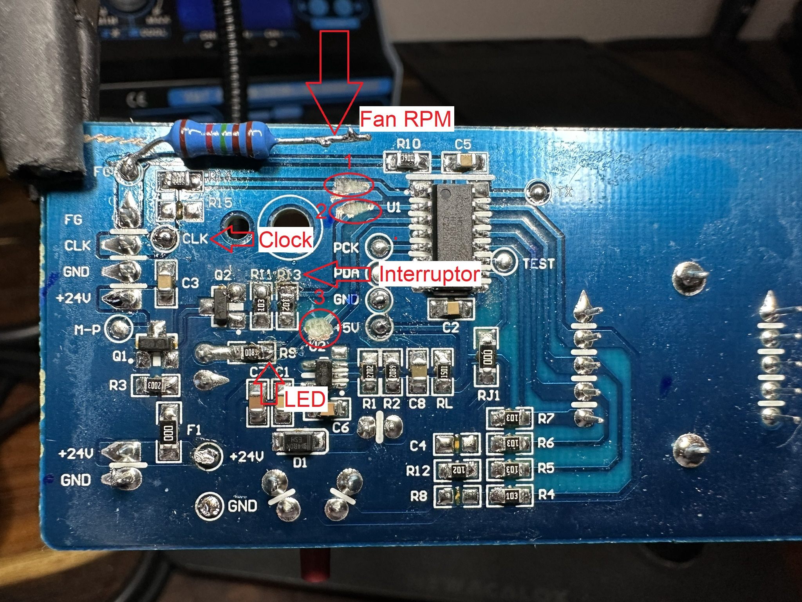
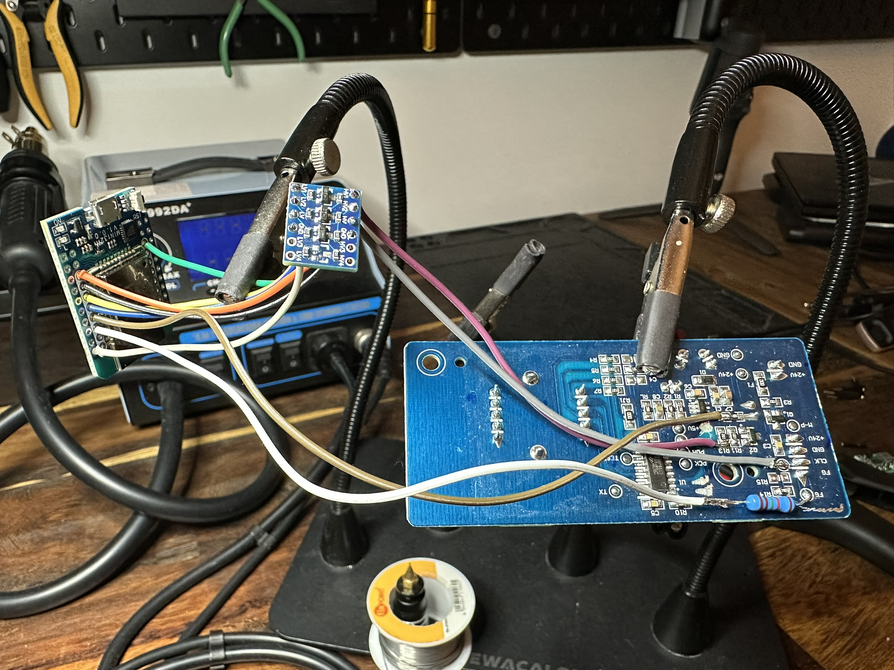

# Ikea-Air-Purifier
A HomeKit-enabled Ikea air purifier project using the HomeSpan library and ESP32. This project supports dynamic fan speed control, RPM monitoring for filter usage tracking, and full control of the purifier's built-in LED. The purifier's LED serves as an on/off indicator and blinks to alert you when the filter has expired.

## Features
- **HomeKit Integration**: Control the purifier using Apple HomeKit.
- **Fan Speed Control**: Adjustable speed via a HomeKit slider.
- **Filter Age Tracking**: Monitors filter usage and alerts when replacement is needed.
- **LED Control**: Full control of the purifier's built-in LED:
    - Used as an on/off indicator.
    - Blinks to alert when the filter has expired.

## Getting Started

### Hardware Requirements
- ESP32 microcontroller
- [3.3 to 5v Level Shifter for CLK and Interruptor](https://learn.sparkfun.com/tutorials/bi-directional-logic-level-converter-hookup-guide/all)
- IKEA Förnuftig air purifier
- 10k Resistor (I am using an 11.5k) and wiring components

### Wiring Instructions  
To have full control of the clock, interruptor (on/off), and LED, you need to scratch the traces 1, 2, and 3 on the IKEA Förnuftig PCB before proceeding with the wiring.

This modification is also required if you use a 3.3V to 5V Bi-Directional Logic Level Converter (needed for compatibility with the ESP32).

  

For a better expalantion, please watch the following video:  

### Software Requirements
- Arduino IDE
- [HomeSpan Library](https://github.com/HomeSpan/HomeSpan)

